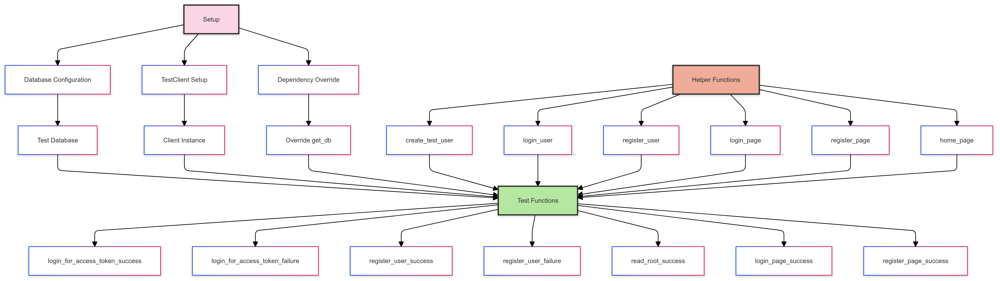

# Integration Testing in FastAPI Applications

let's break down the key parts of the integration tests in `Tests/API_Tests.py`
and how they interact with the application logic in `main.py` and `auth.py`.

### How to write integration tests for FastAPI applications and backend services
Integration tests for FastAPI applications and backend services can be written using the `TestClient` class provided by FastAPI. The `TestClient` class allows you to simulate HTTP requests to your application and verify the responses.

Here are the key steps to write integration tests for FastAPI applications:

1. Set up a test database: Create a test database to use during testing. You can use an in-memory database like SQLite for testing purposes.
2. Override dependencies: Override dependencies like the database session to use the test database during testing.
3. Create a test client: Create a `TestClient` instance to simulate requests to your FastAPI application.
4. Define helper functions: Define helper functions to create test data, send requests, and perform common operations during testing.
5. Write test functions: Write test functions to verify different functionalities of your application, such as user authentication, data retrieval, and API endpoints.
6. Run tests: Run the integration tests using a testing framework like `pytest` to verify the behavior of your application under different scenarios.
7. Analyze test results: Analyze the test results to ensure that your application behaves as expected and handles various scenarios correctly.
8. Refactor and improve: Refactor your code and tests based on the test results to improve the quality and reliability of your application.
9. Repeat: Repeat the testing process regularly to catch bugs and issues early and ensure the stability of your application.
10. Document: Document the integration tests and their purpose to help other developers understand the test cases and their expected outcomes.


### Database Setup and Dependency Override
The test setup includes configuring a test database and overriding the `get_db` dependency to use this test database.

To resolve the unresolved references, you need to import the necessary modules and objects. Here are the required changes:

```python
from sqlalchemy import create_engine
from sqlalchemy.orm import sessionmaker
from your_project.database import Base  # Adjust the import path as necessary

SQLALCHEMY_DATABASE_URL = "sqlite:///./test.db"
engine = create_engine(SQLALCHEMY_DATABASE_URL, connect_args={"check_same_thread": False})
TestingSessionLocal = sessionmaker(autocommit=False, autoflush=False, bind=engine)
Base.metadata.create_all(bind=engine)
```

```python
from fastapi.testclient import TestClient
from your_project.main import app  # Adjust the import path as necessary

client = TestClient(app)
```

```python
from your_project.auth import get_password_hash  # Adjust the import path as necessary
from your_project.models import User  # Adjust the import path as necessary

def create_test_user(db):
    hashed_password = get_password_hash("testpassword")
    db_user = User(username="testuser", email="testuser@example.com", full_name="Test User", disabled=False, hashed_password=hashed_password)
    db.add(db_user)
    db.commit()
    db.refresh(db_user)
    return db_user
```

```python
from your_project.dependencies import override_get_db  # Adjust the import path as necessary

def login_for_access_token_success():
    db = next(override_get_db())
    create_test_user(db)
    response = login_user(client, "testuser", "testpassword")
    assert response.status_code == 200
    assert "access_token" in response.json()
```

```python
def register_user_success():
    db = next(override_get_db())
    response = register_user(client, "testuser", "testpassword")
```

```python
def register_user_failure():
    db = next(override_get_db())
    create_test_user(db)
    response = register_user(client, "testuser", "testpassword", "testuser@example.com", "Test User")
    assert response.status_code == 400
```

```python
def read_root_success(client):
```

```python
def login_page_success(client):
```

```python
def register_page_success(client):
```

These tests ensure that the application behaves correctly under various scenarios, such as successful and failed logins, user registration, and accessing different pages.
Here is the structure of the integration test: 




## Advanced tips and best practices for integration testing in FastAPI applications

Here are some advanced tips and best practices for integration testing in FastAPI applications:

1. **Use fixtures**: Use fixtures in `pytest` to set up common test data and resources that can be reused across multiple test functions.
2. **Mock external dependencies**: Mock external dependencies like third-party APIs, databases, and services to isolate your tests and make them more reliable and repeatable.
3. **Test edge cases**: Test edge cases and boundary conditions to ensure that your application handles unexpected inputs and scenarios correctly.
4. **Use test environments**: Use different test environments like staging and production to test your application in different configurations and settings.
5. **Monitor test coverage**: Monitor test coverage using tools like `coverage.py` to ensure that your tests cover all critical parts of your application.
6. **Automate testing**: Automate testing using continuous integration (CI) tools like GitHub Actions, GitLab CI, or Jenkins to run tests automatically on code changes.
7. **Use logging and debugging**: Use logging and debugging tools to troubleshoot test failures and identify issues in your application.
8. **Collaborate with QA**: Collaborate with quality assurance (QA) engineers to design and execute comprehensive test plans and ensure the quality of your application.
9. **Document test cases**: Document test cases, test data, and expected outcomes to help other developers understand the purpose and scope of the tests.
10. **Review and refactor**: Review your tests regularly and refactor them to improve readability, maintainability, and reliability.

### Advanced Tips and Tricks for Testing in Production

As you progress in your development career, the importance and complexity of testing and deploying applications in production environments become more visible. The strategies and nuances involved in managing production environments vary based on your application’s architecture—whether it's monolithic or microservices. This section provides advanced tips and guidance to help you navigate these challenges efficiently.

1. **Understanding Production Environments**: When transitioning from the development (dev) environment to the production environment, it’s important to understand the different testing strategies required.

    - In the dev environment, you operate in an isolated space where you can experiment, test, and fix issues without impacting end users. It’s low-risk, so breaking things is acceptable and part of the process.
    - In the production environment, the stakes are higher. CI/CD pipelines, dockerized containers, and deployment strategies come into play to ensure that your application runs smoothly and that any updates don’t negatively impact users.

2. **Testing Monolithic vs. Microservices**: Different architectures require tailored approaches when it comes to testing and deploying in production:

    - **Monolithic Architecture**:
        - **Overview**: In a monolithic architecture, the entire application is built and deployed as a single codebase. Updates typically involve deploying the entire application, whether you are making a small or major change.
        - **CI/CD Pipelines and Testing**: CI/CD pipelines manage the entire process of building, testing, and deploying the monolithic application. These pipelines often include rolling updates (gradually replacing old versions with new ones) or immediate deployments (replacing the entire system at once). Testing is straightforward since you are working with a unified codebase. Integration tests ensure that all components work together before pushing to production, making it easier to validate the system as a whole.
        - **Tips**:
            - **Thorough Integration Testing**: Given that everything is deployed together, any bug can impact the entire application. Ensure thorough integration tests are in place to catch any issues early.
            - **Monitoring CI/CD Pipelines**: Regularly monitor and optimize your CI/CD pipelines to catch dependency or deployment issues early. A well-maintained pipeline minimizes downtime and ensures reliable deployments.

    - **Microservices Architecture**:
        - **Overview**: Microservices architecture divides the application into independent services that can be developed, deployed, and scaled separately. While this provides flexibility, it also adds complexity to testing and deployment processes.
        - **Testing Strategies**:
            - **Independent Testing**: Each microservice should have its own unit and integration tests to ensure its functionality independently.
            - **Integration Testing Across Services**: In addition to testing each microservice in isolation, you need to test their interactions to verify that they communicate and function correctly as a whole. This can involve end-to-end tests that validate the behavior of multiple services working together.
        - **Deployment Strategies**:
            - **Rolling Updates**: Gradually replace instances of a microservice with new versions to allow for a smooth transition and to monitor for issues as they arise. This minimizes downtime and reduces the risk of failures.
            - **Blue-Green Deployment**: Deploy the new version of the microservice alongside the existing version, switching traffic over once stability is verified. This approach allows for rollback to the previous version if issues are detected.
        - **Tips**:
            - **Dependency Management**: Microservices often depend on one another. Ensure your deployment plan considers the order and dependencies of services to avoid incompatibilities or failures.
            - **Service Monitoring**: Implement monitoring solutions for each service to track its performance and interactions with other services. Monitoring tools like Prometheus or Grafana can provide real-time insights, helping you catch and resolve issues quickly.
            - **Testing for State Consistency**: In cases where services manage state, ensure that tests validate the consistency of data across different services, especially during updates.

3. **Handling CI/CD Failures in Production**: It’s not uncommon for CI/CD pipelines to fail when deploying code to production. The most frequent causes include dependency conflicts and configuration issues. Here’s how to manage these challenges effectively:

    - **Analyze the Stack Trace**: When a failure occurs, take a deep breath and review the stack trace. Work backwards to identify where the failure happened and understand its cause.
    - **Check for Dependency Issues**: Dependency issues account for 9 out of 10 CI/CD failures. If the stack trace points to a dependency mismatch or versioning problem, collaborate with your DevOps team to resolve it and update your dependencies accordingly.
    - **Collaborate with QA and DevOps Teams**: If the issue stems from the dev environment or test coverage, work with QA to ensure tests are comprehensive. If the issue is related to deployment configuration, consult with DevOps to adjust the pipeline and resolve containerization or versioning issues.
    - **Tips**:
        - **Version Control**: Maintain clear versioning of services and dependencies to reduce conflicts during deployment. Automation tools like Dependabot or Renovate can assist in keeping dependencies up to date.
        - **Fail-Safe Deployment**: Use features like circuit breakers and canary deployments to minimize the impact of a failing service. This allows you to isolate and roll back problematic deployments without affecting the entire system.

4. **Additional Tips for Advanced Production Testing**:
    - **Use Staging Environments**: Staging environments replicate production conditions, allowing you to test code and updates before deploying to production. This step reduces the risk of issues reaching end users.
    - **Implement Health Checks and Logging**: Implement health checks to monitor the status of services continuously. Use logging frameworks to capture detailed logs, providing visibility into the application’s state and aiding in troubleshooting when issues arise.
    - **Focus on Observability**: Invest in observability tools like distributed tracing (e.g., Jaeger) and logging aggregation (e.g., ELK stack) to gain insight into microservices interactions and dependencies. This is particularly important in microservices environments, where issues can cascade between services.

5. **Final Thoughts: Testing as a Collaborative and Iterative Process**:
    - **Collaboration**: Collaborate with QA, DevOps, and other developers to determine the appropriate testing strategies based on the application architecture and business requirements.
    - **Iterate and Improve**: Testing is not a one-time process. Regularly review and refine your testing practices and CI/CD pipelines to adapt to the evolving architecture and application needs.
    - **Stay Calm Under Pressure**: Crashing production is not uncommon—it’s a rite of passage. The key is to handle issues methodically, working through stack traces and collaborating with your team to resolve the issue swiftly.

By understanding and applying these advanced tips, you can better manage testing and deployment in production, ensuring that your applications remain reliable and performant, regardless of their architecture.

## Code Coverage, Error Handling, and Logging: Best Practices

Ensuring that your application runs smoothly in production requires a multi-faceted approach that includes comprehensive code coverage, effective error handling, and robust logging. Each of these components plays a critical role in maintaining the reliability, performance, and observability of your application.

### 1. Code Coverage

**Overview:**
Code coverage measures the extent to which your tests cover the codebase, ensuring that critical paths, edge cases, and functionality are validated. High code coverage doesn’t necessarily guarantee a bug-free application, but it does provide confidence that most scenarios are accounted for.

**Measuring Code Coverage:**
- Use tools like `coverage.py` (for Python) or `Jacoco` (for Java) to measure how much of your codebase is covered by tests.
- Aim for a balanced coverage percentage (e.g., 80–90%). While 100% coverage is ideal, it may not always be practical.

**Improving Code Coverage:**
- Prioritize testing the most critical parts of the codebase, such as API endpoints, authentication logic, and data processing components.
- Regularly review code coverage reports and identify gaps.

**Automating Code Coverage Reports:**
- Integrate code coverage tools into your CI/CD pipelines to automate the generation of reports whenever code is pushed.

### 2. Error Handling

**Overview:**
Effective error handling is crucial for building resilient applications that can recover gracefully from unexpected scenarios, such as invalid user input, network failures, or service outages.

**Implementing Error Handling:**
- **Centralized Error Management: ** Use middleware or centralized error handling modules (e.g., exception handlers in FastAPI) to manage errors uniformly across the application.
- **Specific vs. Generic Errors: ** Avoid catching all errors with generic handlers unless absolutely necessary. Instead, catch specific exceptions to provide more informative and actionable responses.
- **Custom Error Messages: ** Provide meaningful error messages that describe what went wrong and, when appropriate, suggest solutions or corrective actions for the user.

**Handling Edge Cases and Boundary Conditions:**
- Test and handle edge cases like null values, out-of-range inputs, and timeouts.
- Validate inputs rigorously to prevent issues such as injection attacks or invalid data types from causing downstream errors.

### 3. Logging

**Overview:**
Logging is a critical aspect of maintaining visibility into your application’s behavior, especially in production environments. Proper logging allows you to track the state of your application, monitor for errors, and debug issues when they occur.

**Types of Logs:**
- **Info Logs:** Provide general information about application events, such as API requests, successful transactions, or user login activities.
- **Warning Logs:** Indicate potentially problematic situations that may not require immediate action but could become issues later.
- **Error Logs:** Capture critical errors that impact the application’s functionality.
- **Debug Logs:** Offer detailed information about application state and variables, useful during development and troubleshooting.

**Best Practices for Logging:**
- **Structured Logging:** Use structured logging formats like JSON to make logs easier to parse and analyze.
- **Log Levels: ** Implement log levels (e.g., DEBUG, INFO, WARNING, ERROR) to control the verbosity of logs in different environments.
- **Avoid Sensitive Information:** Ensure that logs do not contain sensitive information such as passwords, personal data, or API keys.
- **Centralized Logging:** Use centralized logging solutions to aggregate logs from different parts of your application.

### 4. Integrating Code Coverage, Error Handling, and Logging

**Automated Monitoring and Alerts:**
- Integrate code coverage reports and error logs into your CI/CD pipeline, and set up automated alerts for failed tests or critical errors.
- Use monitoring tools like Prometheus combined with alerting systems like Alertmanager to detect anomalies in your application’s behavior.

**Observability Across Environments:**
- Ensure that error handling and logging practices are consistent across both the dev and production environments.
- Implement distributed tracing (e.g., Jaeger or Zipkin) in microservices environments to gain insight into how requests flow through your services.

### 5. Final Thoughts: Building Resilient Applications

Code coverage, error handling, and logging are foundational practices for building robust applications that can handle unexpected scenarios and maintain reliability in production. By integrating these practices into your development lifecycle and CI/CD pipelines, you ensure that your application is not only tested thoroughly but also capable of gracefully managing errors and providing clear visibility into its operation. Collaborate with your team to continually review and refine these processes, adapting them as your application evolves.

### **Conclusion**

Effective testing, error handling, and logging are critical parts in building reliable and resilient software applications. Whether working within monolithic or microservices architectures, understanding the nuances of testing in dev and production environments, maintaining comprehensive code coverage, and implementing robust logging systems are essential practices that ensure application stability and performance.

By integrating CI/CD pipelines, setting up automated monitoring, and collaborating closely with QA and DevOps teams, developers can streamline their workflows, detect issues early, and respond swiftly to bugs or failures. Emphasizing structured logging, managing dependencies proactively, and thoroughly testing edge cases further solidifies the application's ability to handle real-world scenarios and user interactions.

Ultimately, the goal is to create software that not only meets functional requirements but also stands up to the complexities and uncertainties of production environments. Continuously refining these practices and embracing a culture of collaboration and adaptability are key to developing and maintaining high-quality applications that provide reliable, seamless experiences for end users.

By adopting these best practices and strategies, developers at all levels—from junior to senior—can build confidence in their skills, ensure the robustness of their applications, and contribute to the success and reliability of their development teams and organizations.
